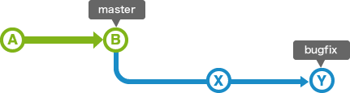

## Branching

1. You can create your own branch and track your changes.
2. Your branch will be independent from other branches.
3. You can merge your branch with others.



* View the list of branches


```bash
    $ git branch
```

* Create a new branch

  ```bash
  git branch <your_branch_name>
  ```


```bash
    $ git branch sub1
```

* Switch over to a new branch


```bash
    $ git checkout sub1
```

   

* Make changes to the files or add a new file


```bash
    $ git add readme.md

    $ git commit -m 'add'
```

* After doing this, you may fix the identity used for this commit with:


```bash
    $ git commit --amend --reset-author
```

* Push a file to the new branch


```bash
    $ git push origin sam1
```


* Delete your branch


```bash
$ git branch -d <branchmane>
```

* Merge branch


```bash
$ git merge <branch>
```

### Merge Branch

Merge can be used to integrate multiple trails of revisions.

Examples:


1. Merge when **master** branch (**B**) has no change (**fast-forward merge**): just move **bugfix** (**Y**) to **B** since **Y** contains all the version history.

    

    You can use **`non fast-forward`** option to create a new merge comit (**C**).

    

2. Merge when **B** has changes (Versions **C** and **D** of master branch):

    

    In this example, a new merge comit will be created which contains all the changes from **D** and **Y**

    


### Rebase

Example:

   

   If **rebase** is used to merge branches, version history of **Y** will be created after master branch. If **X** and **Y**  have discrepancies, these need to be fixed.


   

   **D** will be in the same place unless **D** is merged with **Y'**, so you have to merge **D** and **Y**

   

   

## Git Branching Model

[A successful Git branching model](http://nvie.com/posts/a-successful-git-branching-model/) is a good source for git branching model.

It introduces 4 branches

1. Main Branch
    * master --- Reflects a production-ready state. Uses tag id (0.1, 0.2 etc) in commit to record the release #.
    * develop --- Development branch --- uses rebase+merge
2. Feature Branch --- a branch from develop branch. For development of new functions/debug
3. Release Branch --- prep. for release --- uses merge to maser. record the release # in commit. It can be merged to develop branch for importing last minor changes
4. Hotfix Branch --- use to address critial issues that need to be fixed quickly. Uses 'hotfix-' as the prefix for branch name

   
