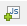
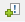
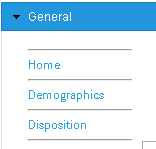

# Accordion navigation in Spotfire

1. Go to **Edit HTML** from the **Text Area**
2. Click  icon.
3. Create a **New** script. You can paste below script.
4. The name of the script can be anything

```java
$(document).ready(function(){
  var currentId=getCurrentId()

      //sets the active panel to 0 if key isn't defined in local storage
      n=parseFloat(localStorage.getItem(currentId)) || 0;

      //uses the change event to set the active panel
      $('#myaccordion').accordion({
          active: n,
          change: function(event,ui){
              selectedPanel=$('#myaccordion').accordion('option','active')
              localStorage.setItem(currentId,selectedPanel);
          }
      });


  //returns location of the current session
  function getCurrentId(){
      var loc = window.location;

      if(loc.href.length >= 70){
          loc=loc.href.substring(0,4)
      }
      else{
          loc=loc.href.substring(0,0)
      }
      return loc;
  };
});
```

5. After you add script, you can start adding the menu with HTML.

- The first line `<DIV id=myaccordion>` should be kept and closed by `</DIV>`.
- `<h3></h3>` is used for a section title.
- Each section is enclosded with `<div></div>`.
- Within each link, I use a horizontal line `<hr>`.
- The actual link can be added with  Action Control. It will turn into something like `<SpotfireControl id="2d0e3cbd923c4c1b976c274f6e5fe5af" />`



Sample HTML code:
```HTML
<DIV id=myaccordion>
    <H3 align=left>General</H3>
      <DIV>
        <HR>
          <SpotfireControl id="2d0e3cbd923c4c1b976c274f6e5fe5af" />
        <HR>
          <SpotfireControl id="df5e036149624e83b02c9416e4632ddb" />
        <HR>
          <SpotfireControl id="f45c3906f23b4a479bbd4b578c2e8f89" />
        <HR>
      </DIV>
</DIV>
```

2019-01-03
